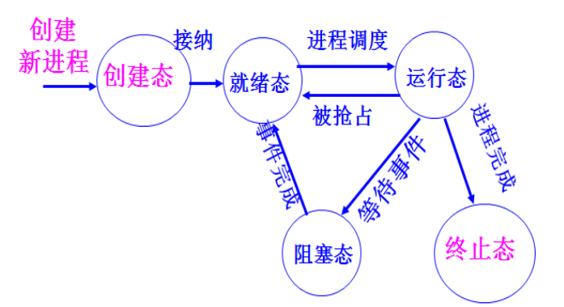

# 操作系统 - 期末考试
## 题型/分值
 - 判断题/10
 - 选择题/10
 - 填空题/25
 - 简答题/25
 - 综合题/30

## CH1 操作系统概论
### 早期操作系统设计的主要目标是什么?
 - 方便性：方便用户使用计算机。用户通过操作系统来使用计算机。
 - 有效性：使计算机系统能高效可靠地运转，提高系统资源的利用率。
 - 还要便于操作系统的设计、实现和维护。

### 操作系统的特性?
 - 并发性：为了增强计算机系统的处理能力而采用的一种时间上重叠操作的技术。
 - 共享性：支持系统并发性的物质基础是资源共享。为了提高计算机系统的资源利用率，更好地共享系统资源，操作系统的各部分功能设计中采用了各种各样的分配调度算法。

 - 虚拟性：便于用户程序共享计算机系统的各种资源，操作系统把这些资源的一个物理实体变为逻辑上的多个对应物。

 - 异步性：由于系统资源的共享，有限的资源使并发进程之间产生相互制约关系。异步性给系统带来潜在的危险，有可能导致系统产生与时间有关的错误。

 1. 并发性：并发是指系统中存在着若干个逻辑上相互独立的程序，它们都已被启动执行，都还没有执行完，并竞争系统资源。 

 2. 共享性：是指系统中的资源可供内存中多个并发执行的进程共同使用。如打印机、磁带机、磁盘等。 支持系统并发性的物质基础是资源共享 
 
 3. 虚拟性：把共享资源的一个物理实体变为若干个逻辑上的对应物。如，CPU的分时共享；虚拟存储器技术。 
 
 4. 异步性（随机性）：有限的资源共享使并发进程之间产生相互制约关系。各个进程何时执行、何时暂停、以怎样的速度向前推进、什么时候完成等都是不可预知的。

### 衡量 OS 的性能指标有哪些?什么是吞吐量、响应时间和周转时间?
 - 衡量性能指标：系统效率；系统可靠性；可移植性；可伸缩性；兼容性；安全性。
 - 吞吐量：单位时间内系统所处理的信息量。
 - 响应时间：用户发出请求或指令到系统做出反应。 
 - 周转时间：作业进入系统到作业退出系统所经历的时间。 
 
### 为了实现系统保护,CPU 通常有哪两种工作状态?各种状态下分别执行什么程序?什么时候发生状态转换?状态转换由谁实现的?
 - 用户态：用户程序运行其中。只允许执行处理机的非特权指令，访问指定的寄存器和存储区。
 - 核心态：操作系统程序运行其中。允许执行处理机的全部指令集，访问所有的寄存器和存储区。
 - 用户态到核心态：由硬件实现。
 - 核心态到用户态：操作系统程序执行后完成。
 
 
## CH2-3 进程管理
### 进程的基本状态,试举出使进程状态发生变化的事件并描绘它的状态转换图。(理解)
 1. 运行态(running)：进程正在CPU上运行。单CPU系统一次只有一个运行进程；多CPU系统可能有多个运行进程。
 2. 阻塞态(blocked)：又称等待态。当进程因等待某个条件发生而不能运行时所处的状态。等待I/O完成，等待一个消息
 3. 就绪态(ready)：已获得除CPU之外的全部资源，只要再获得CPU，就可执行。
 4. 创建态：刚刚建立，未进就绪队列。
 5. 终止态：已正常结束或故障中断，但尚未撤消。暂留在系统中，方便其它进程去收集该进程的有关信息。
 
 
### 什么是原语?什么是进程控制?(理解)
 - 原语是由若干多机器指令构成的完成某种特定功能的一段程序，具有不可分割性.
  - 即原语的执行必须是连续的，在执行过程中不允许被中断
 - 进程控制：是指系统使用一些具有特定功能的程序段来创建、撤消进程，以及完成进程各状态之间的转换。
  - 进程控制是由操作系统内核实现的。是属于原语一级的操作，不能被中断。

### 进程调度的功能、方式、时机、算法。作业调度,交换调度。作业的周转时间和作业的带权周转时间(计算)?
 - 处理机的三级调度：
高级调度---作业调度
低级调度---进程调度
中级调度---交换调度
 - 进程调度的功能：
①记录系统中各进程的执行状况 
②选择就绪进程真正占有CPU 
③进行进程上下文的切换
 - 进程调度的方式：
①非抢先方式(非剥夺方式) 用在批处理系统。主要优点：简单、系统开销小。
②抢先方式(剥夺方式) 用在分时系统、实时系统。
 - 进程调度的时机：
①现行进程完成或错误终止； 
②提出I/O请求，等待I/O完成时； 
③在分时系统，按照时间片轮转，分给进程的时间片用完时； 
④优先级调度，有更高优先级进程就绪； 
⑤进程执行了某种操作原语，如阻塞原语和唤醒原语时，都可能引起进程调度。
 - 进程调度算法：
 	 - （批处理&&分时系统）批处理为了增加系统吞吐量和提高系统资源的利用率；
	- 分时系统为了保证每个分时用户能容忍的响应时间。
①先来先服务FCFS 作业调度
②最短作业的进程优先调度法SJF 作业调度
③响应比高者优先HRN 作业调度
 `Rp =(作业等待时间+作业估计运行时间)/作业估计运行时间=1+作业等待时间/作业估计运行时间 `
④优先级调度法Priority Scheduling 进程调度
⑤轮转法RR 分时系统
 - 进程调度算法：（实时系统）为了保证对随机发生的外部事件做出实时响应。
①时钟驱动法
②加权轮转法

### 并发执行的进程在系统中通常表现为几种关系?各是在什么情况下发生的? 
 - 对资源的共享引起的互斥关系：进程之间本来是相互独立的，但由于共享资源而产生了关系。
 间接制约关系，互斥关系。 
 - 协作完成同一个任务引起的同步关系：一组协作进程要在某些同步点上相互等待发信息后才能继续运行。
 直接制约关系。同步关系。 
 - 进程之间的前序关系：由于进程之间的互斥同步关系，使得进程之间具有了前序关系，这些关系决定了各个进程创建和终止的时间。 

### 什么叫临界资源?什么叫临界区?对临界区的使用应符合的四个准则（互斥使用、让权等待、有空让进、有限等待）
 - 临界资源：就是一次仅允许一个进程使用的资源。
 - 临界区：就是并发进程访问临界资源的那段必须互斥执行的程序。
 - 临界区使用的准则：
 ①互斥使用：不能同时有两个进程在临界区内执行
 ②让权等待：等待进入临界区的进程，应释放处理机后阻塞等待
 ③有空让进：在临界区外运行的进程不可阻止其他进程进入临界区 
 ④有限等待：不应使要进入临界区的进程无限期等待在临界区之外

### 若信号量 S 表示某一类资源,则对 S 执行P、V 操作的直观含意是什么? 当进程对信号量 S 执行 P、V 操作时,S 的值发生变化,当 S>0、S=0、和 S<0 时,其物理意义是什么?(看作业)
 - 设置一个互斥信号量mutex，初值为1，表示该临界资源空闲。信号量的取值范围：+1～ -(n-1)。 
 - 调用P(mutex)申请临界资源。执行P操作时，将信号量s.value-1
 若s.value>=0，则执行P操作的进程继续执行
 若s.value<0，则执行P操作的进程变为阻塞状态，并排到与该信号量有关的list所指队列中等待
 - 调用V(mutex)释放临界资源。执行V操作时，将信号量s.value+1
 若s.value<=0，则执行V操作的进程从与该信号量有关的list所指队列中释放一个进程，使它由阻塞变为就绪状态，之后执行V操作进程继续执行
 若s.value>0，则执行P操作的进程继续前进
 
### 进程高级通信有哪些实现机制?(大致了解)
- 是指进程采用系统提供的多种通信方式来实现通信。
如消息缓冲、信箱、管道、共享主存区等。
- 发送进程和接收进程的消息通信方式：
①非阻塞发送，阻塞接收
②非阻塞发送，非阻塞接收
③阻塞发送，阻塞接收

### 死锁产生的必要条件及解决死锁的方法
 - 死锁产生的必要条件：
①互斥条件。独占性的资源。
②保持和等待条件。进程因请求资源而阻塞时，对已经获得的资源保持不放。
③不剥夺条件。已分配给进程的资源不能被剥夺，只能由进程自己释放。
④循环等待条件。存在一个进程循环链，链中每个进程都在等待链中的下一个进程所占用的资源。
 - 产生死锁的根本原因：
 是对独占资源的共享，并发执行进程的同步关系不当。
 - 解决死锁的方法：
①鸵鸟算法：忽略死锁。
②死锁的预防：通过破坏产生死锁的四个必要条件中的一个或几个，来防止发生死锁。
③死锁的避免：是在资源的动态分配过程中，用某种方法去防止系统进入不安全状态，从而避免发生死锁。
④死锁的检测和恢复：允许死锁发生，通过设置检测机构，及时检测出死锁的发生，然后采取适当措施清除死锁。

### 理解银行家算法的实质。能够利用银行家算法避免死锁。(揣摩清楚)
 - **HW3-21**
 
 ## CH4 存储器管理
 
### 存储保护的目的是什么?对各种存储管理方案实现存储保护时,硬件和软件各需做什么工作?
 - 防止地址越界：
 进程运行时产生的所有存储器访问地址都要进行检查，确保只访问为该进程分配的存储区域。
 - 正确地进行存取：
 对所访问的存储空间的操作方式（读、写、执行）进行检查，以防止由于误操作，使其数据的完整性受到破坏。
 - 硬件: MMU 转化 LA-PA
 - 软件: 存储管理方案 检查地址合法
 
### 试述可变式分区管理空闲区的方法及存储区的保护方式。覆盖与交换有什么特点?(相关数据结构、分配算法)
 - 分配算法：
 ①首次适应(first fit)法
 ②最佳适应(best fit)法 
 ③最坏适应(worst fit)法
 - 存储区保护方式：
 ①固定分区：静态重定位，进程运行时使用主存物理地址；
 设置上、下界寄存器来实现存储器保护。
 ②可变式分区：动态重定位，进程运行时CPU给出的是程序的逻辑地址；
 基址+限长寄存器。
 - 覆盖
 同一主存区可以被不同的程序段重复使用。
 	- 特点
 	打破了必须将一个进程的全部信息装入主存后才能运行的限制。
 	在逻辑上扩充了主存
 	小主存可运行大进程
 - 交换
 系统根据需要把主存中暂时不运行的进程中的部分或全部信息移到外存，而把外存中的进程移到主存，并使其投入运行
 	- 特点
	打破了一个程序一旦进入主存，便一直运行到结束的限制
 
 - 交换主要是在进程之间进行，而覆盖则主要在同一个进程内进行
 
### 什么是虚拟存储器。虚拟存储器的容量能大于主存容量加辅存容量之和吗?(怎样实现)
 - 虚拟存储器
是系统为了满足应用对存储器容量的巨大需求而构造的一个非常大的地址空间。
CPU硬件结构决定了虚拟存储器容量。
 - 系统的指令地址部分能覆盖的地址域大于实际主存的容量。
 - **HOW to work?**

### 产生缺页中断时,系统应做哪些工作?(理解)
①根据当前执行指令中的逻辑地址查页表的状态位。
②状态位为0，缺页中断。
③操作系统处理缺页中断，寻找一个空闲的内存页。
④若有空闲页，则把从磁盘读入信息装入该页面。
⑤若无空闲页，则按某种算法选择一个已在内存的页面，暂时调出内存。若修改过还要写磁盘。调入需要的页。之后要修改相应的页表和内存分配表。
⑥恢复现场，重新执行被中断的指令。

### 会利用 FIFO、LRU、OPT 以及时钟页面置换算法描述页面置换过程,计算产生的缺页率。Belady 异常。(算法、处理方式、看作业)
 - **HW4-16**

### 什么是程序的局部性原理?什么叫系统抖动?工作集模型如何防止系统抖动?(理解)
 - 时间局部性：程序中往往含有许多循环，在一段时间内会重复执行该部分。
 - 空间局部性：程序中含有许多分支，在一次执行中，只有满足条件的代码运行，不满足条件的代码不运行。
 - 抖动：页面频繁的换入换出。
 - 防止：操作系统跟踪每个进程的工作集，并为进程分配大于其工作集的物理块。
         如果所有工作集之和增加到超过了可用物理块的总数，操作系统会暂停一个进程，将其页面调出并且将其物理块分配给其他进程，防止出现抖动现象。

## CH5 文件系统
### 文件的逻辑结构有几种形式?文件的存取方法?
 - 文件的逻辑结构： 
①无结构的字节流式文件：由无结构的先后到达的相关字节组成，其文件长度就是所包含的字节个数。 
②有结构的记录式文件：分为定长记录式文件和变长记录式文件。 
 - 文件的存取方式： 
①顺序存取：按照文件信息的逻辑顺序依次存取。是在前一次存取的基础上进行的。 
②直接存取（随机存取）：基于文件的磁盘模型，磁盘允许对任意文件块进行随机读和写。对于变长记录式文件，十分低效。

### 文件的物理结构有哪几种?对于不同的结构,文件系统是如何进行管理的?
①连续文件（顺序文件）文件内容连续存放。
优点：简单；支持顺序存取和随机存取；存取速度快。只要访问一次文件的管理信息，就可方便地存取到任一记录。
缺点：不灵活；容易产生碎片。连续结构适合存储长度不变的文件系统。
②链接文件：不要求文件内容连续存放。把文件所占用的物理块用链接指针链接起来。
优点：可以解决外存的碎片问题，提高了外存空间的利用率；允许文件动态增长。
缺点：只能按文件的指针链顺序存取，查找效率较低。
为了克服链接结构文件的缺点，可以把指针字从文件的各物理块中取出，放在一个表中，并将此表叫盘文件映射表。
MS-DOS就使用这种方式分配和管理磁盘空间，并将该表叫做文件分配表。利用文件分配表，不但能方便地实现顺序存取，而且也很容易实现随机存取。但缺点是运行时整个表必须在主存，主存消耗大。
③索引文件：为每个文件建立一张索引表。用索引表记录文件内容的存放地址，即记录文件的逻辑块号和对应的物理块号之间的关系。
优点：文件可动态修改；随机、顺序存取。
缺点：索引表的使用增加了存储空间的开销；降低了文件的存取速度。
④索引顺序文件

### 文件存储空间的管理方法有几种?它们各是如何实现文件存储空间的分配和回收的?
①空白文件目录（是一种最简单的方法）
当请求分配存储空间时，系统依次扫描空闲文件目录表目，直到找着一个合适的空闲文件为止；当用户撤消一个文件时，系统回收该文件所占用的空间。这时也需要顺序扫描空闲文件目录，寻找一个空表目，并将释放空间的第一个物理块号及它所占的块数填入到这个表目中。
②空闲块链表：当用户建立文件时，就按需要从链首依次取下几块分配给文件。当撤消文件时，回收其存储空间，并将回收的空闲块依次链入空闲块链中。
③位映像表(bit map)或位示图：是适合文件静态分配和动态分配的最简单方法。

### 文件系统中,常用的文件操作命令有哪些?它们的具体功能是什么?打开和关闭文件命令的目的是什么?
①创建(Create)文件
主要功能：在指定设备上为指定路径名的文件建立一个目录项，并设置文件的有关属性。
②删除(Delete)文件 主要功能：根据文件的路径名找到指定的目录项，回收其占用的各个物理块，再将该目录项置为空。
③打开(Open)文件
根据文件路径名找到目录项，将文件的目录项复制到主存一个专门区域，返回文件在该区域的索引。建立进程与文件的联系。
目的：避免多次重复地检索文件目录。
系统维护了一个系统当前打开文件表。当读/写文件时，通过这个表的索引找到文件的主存目录项。不需要重复地对磁盘进行检索。
④关闭(Close)文件
释放文件在主存专门区域中的目录项，切断用户与文件的联系。
若该目录项被修改过，则复制到磁盘。
若文件作过某些修改，应将其写回辅存。
⑤读(Read)文件
命令中必须指出要读的数据个数，以及存放数据的主存地址。
根据文件所在设备、文件类型的不同，系统设置不同的读命令。
⑥写(Write)文件
命令中必须指出要写的数据个数，以及存放数据的主存地址，将主存中的数据写到指定的文件中。
⑦追加(Append)文件
限制了写文件的形式，将数据追加到文件尾。
⑧随机存取(Seek)文件
重新定位文件的读/写位置指针。
⑨得到文件属性(Get Attributes)
进程在执行时常常需要了解文件的属性。在UNIX系统中，一个软件开发项目通常由多个源文件组成，make程序用来管理这些软件开发项目。
当make被调用时，它检查所有源文件和目标文件的修改时间，并且编排出需要重新编译的文件数。
⑩设置文件属性(Set Attributes)
修改文件的一些属性，以适应用户的要求。
⑩重命名(Rename)文件
重新命名一个已经存在的文件。

## CH6 设备管理

### 常用的四种数据传输方式。
①程序查询方式（polling）：该方式的工作过程非常简单，但CPU的利用率低。
因为CPU执行指令的速度高出I/O设备几个数量级，所以在循环测试中浪费了大量的CPU处理时间。
②中断方式：CPU一旦启动设备成功，CPU转去执行另一个程序。
当设备完成时，向CPU提出中断请求，CPU执行完当前一条指令，就响应中断，转去执行中断处理程序。从而使CPU可与设备并行操作。
③直接存储器访问(DMA)方式：
允许DMA控制器接管地址总线的控制权，直接控制控制器内部缓冲区与主存之间的数据交换。
比较：
a.中断方式是在数据缓冲R满之后，发中断要求CPU进行处理，而DMA方式则是在所要求转送的数据块全部结束时，要求CPU处理。这就大大减少了CPU进行中断处理的次数。
b.中断方式的数据传送是在中断处理时，由CPU控制完成的，而DMA方式则是在DMA控制器的控制下完成的。
④通道控制方式:
与DMA方式相比，通道所需的CPU干预更少，且可以做到一个通道控制多台设备，进一步减轻了CPU的负担。
通道是一种专用的I/O处理机。
通道有自己的指令系统，若干条通道命令连接成通道程序。

### 根据设备的使用方式,设备被分为几种类型?何为虚拟设备?它是通过什么技术实现的?
 - 虚拟设备，共享设备，独占设备。
 - 虚拟设备：是指设备本身是独占设备，而经过虚拟技术处理，可以把它改造成共享设备，供多个进程同时使用。常用可共享的高速设备来模拟独占的慢速设备。能有效提高独占型设备的利用率。
 - Spooling技术是实现虚拟设备的具体技术。它利用可共享磁盘的一部分空间，模拟独占的输入/输出设备。以空间换时间

### 何为设备的独立性?
 - 设备独立性是指用户及用户程序不受系统配置的设备类型和具体设备的台号的影响。用户只是使用逻辑设备,具体的映射由操作系统完成。 - **理解、例子** 
### 常用的磁盘调度算法:先来先服务、最短寻道时间优先、扫描法(SCAN,C_SCAN,LOOK,C_LOOK)。(理解、看作业)
 - 设某单面磁盘的旋转速度为每分钟6000转，每个磁道有100个扇区，相邻磁道间的平均移动时间为1ms。若在某时刻，磁头位于100号磁道处，并沿着磁道号增大的方向移动，磁道号的请求队列为50、90、30、120，对请求队列中的每个磁道需读取1个随机分布的扇区，则读完这4个扇区总共需要多少时间？需要给出计算过程。 

 - 解：
循环查询C-LOOK算法。
被请求的磁道号顺序为100、120、30、50、90，因此:
寻道需要移动的磁道数为：20+90+20+40=170。
寻道用去的总时间为：(20+90+20+40)×1ms=170ms
磁盘每分钟6000转，转一圈的时间为0.01s，通过一个扇区的时间为0.0001s。
总共要随机读取四个扇区，用去的时间为：(0.01×0.5+0.0001)×4=0.0204s=20.4ms
所以170ms+20.4ms=190.4ms

## CH7-10 Linux
### 与进程创建有关的函数:fork()、vfork()、clone()。(大致知道做什么)
 - fork()创建子进程函数：
 创建成功之后，子进程采用写时复制技术读共享父进程的全部地址空间，仅当父或子要写一个页时，才为其复制一个私有的页的副本。 
 - vfork()系统调用：
 创建的子进程能共享父进程的地址空间，为了防止父进程重写子进程需要的数据，先阻塞父进程的执行，直到子进程退出或执行了一个新的程序为止。
 - clone()创建轻量级进程函数：
 实现对多线程应用程序的支持。共享进程在内核的很多数据结构，如页表、打开文件表等等。

### 理解进程切换的过程。涉及到页目录表、核心栈、硬件上下文。(2部分)
 - 进程切换只发生在核心态。
 在发生进程切换之前，用户态进程使用的所有寄存器值都已被保存在进程的核心栈中。
 进程硬件上下文存放在进程描述符的thread_struct thread中。
 - 第一步，切换页目录表以安装一个新的地址空间；
 - 第二步，切换核心栈和硬件上下文。
 由schedule()函数完成进程切换。

### 进程调度方式。进程调度时机。(了解)
 - 可抢先式的动态优先级调度方式。
 其内核是完全可重入的。
 无论进程处于用户态还是核心态运行，都可能被抢占CPU，从而使高优先级进程能及时被调度执行，不会被处于内核态运行的低优先级进程延迟。
 - 实时进程调度时机：
（1）出现了更高优先级的实时进程。
（2）进程执行了阻塞操作而进入睡眠状态。
（3）进程停止运行或被杀死。
（4）进程调用自愿放弃处理机。
（5）在基于时间片轮转的实时进程调度过程中，进程用完了自己的时间片。

### Linux有很多内核线程,了解0号进程和1号进程的作用。
 - 0号进程就是一个内核线程，0号进程是所有进程的祖先进程，又叫idle进程或叫做swapper进程。
 每个CPU都有一个0号进程。
 - 1号进程是由0号进程创建的内核线程init，负责完成内核的初始化工作。
 在系统关闭之前，init进程一直存在，它负责创建和监控在操作系统外层执行的所有用户态进程。

### 进程地址空间的划分?管理进程私有地址空间的数据结构?链接虚拟内存区域的单链表和红黑树。指向映射文件对象的指针字段?指向进程页目录表的指针字段?
 - 32位机，每个进程的地址空间为4GB。
 Linux把地址空间分成两部分。进程的私有空间是前3G，进程的公有空间是后1G的内核虚空间。
 - Linux系统对进程已分配的虚拟内存区域采用两种数据结构进行管理：
 单向链（虚拟内存区域数较少），红黑树（虚拟内存区域较多）。
 当插入或删除一个虚拟内存区域时，通过红黑树搜索其相邻节点，并用搜索结果快速更新单链表。 
 管理进程地址空间中的所有保留的虚拟内存区域。
 虚拟内存描述符mm_struct。
 虚拟内存描述符中mm_rb指向红黑树的根，mmap指向单链表。pgd指向页目录表。

### 管理物理内存页框的数据结构?内存管理区zone结构,伙伴系统?分区页框分配器分配页框的过程。
 - 页框描述符为struct page。
 所有页框描述符存放在mem_map数组中。
 - Linux把内存节点划分为3个管理区zone：
 ①ZONE_DMA：包含低于16MB的常规内存页框。用于对老式的基于ISA设备的DMA支持。 
 ②ZONE_NORMAL：包含高于16MB且低于896MB的常规内存页框。 
 ③ZONE_HIGHMEM：包含从896MB开始的高端物理页框。内核不能直接访问这部分页框。在64位体系结构上，该区总是空的。
 - 在每个管理区内的页框，除了一小部分页框被保留为每CPU页框高速缓存外（以满足本地CPU发出的对单个页框的请求），其它的由伙伴系统来管理。
 - 采用伙伴系统(buddy system)管理连续的空闲内存页框，以解决外碎片问题。
 
### 进程页表建立的时机?了解页目录表项或页表项所包含的字段。逻辑地址的划分,利用两级页表实现地址转换的过程。
 - 虚地址分成3个域：
 页目录索引（前10位）
 页表索引（中10位）
 页内偏移（后12位）
 - 32位处理机普遍采用二级页表模式，为每个进程分配一个页目录表，页表一直推迟到访问页时才建立，以节约内存。 
 - 实地址转换分两步进行:
 第一步由页目录索引查页目录表，以确定相应的页表位置；
 第二步由页表索引查页表，以确定相应的物理页框位置。
 
### Ext2文件卷的布局?各部分的作用是什么?
 - 由若干个磁盘块组成。1个引导块和n个块组。
 - 每个块组又由超级块、块组描述符、数据块位图、文件的索引节点位图、索引节点区和文件数据区组成。

### Linux文件系统的索引节点中,索引表划分成几级?文件的索引表是如何增长的?要求能够利用索引表实现将文件中的字节地址转换成文件的物理块的操作。(最大规模如何取得)
 - 四个级别
 直接索引；一级索引；二级索引；三级索引。

### 硬链接和符号链接的区别?
 - 符号链接不与文件的索引节点建立链接，可以跨文件系统（当为一个文件建立符号链接时，索引节点的硬链接计数不改变）

### VFS通用文件模型中的四个主要对象?(作用)
 - ①超级块对象：
 Linux为每个安装好的文件系统都建立一个超级块对象。
 - ②索引节点对象：
 对于具体文件系统，它代表一个文件，对应于存放在磁盘上的文件控制块。
 每个文件都有一个索引节点对象，每个索引节点对象都有一个唯一的索引节点号，来**标识**文件系统中的一个特定文件。
 - ③目录项对象：
 代表一个目录项，是一个文件路径的组成部分，**存放目录项与对应文件进行链接的信息**。
 - ④文件对象：
 **记录了进程与打开的文件之间的交互信息**。
 
## CH14-17 WINDOWS
### Windows 系统组件的基本机制包括
 - 陷阱调度
 - 执行体对象管理器
 - 同步(自旋锁、内核调度程序对象)
 - 本地过程调用LPC等

### 理解:延迟过程调用 DPC,异步过程调用 APC
 - DPC被用来执行一些相对于当前高优先级的任务来说不那么紧急的任务。
 有时内核在进行系统嵌套调用时，检测到应该进行重调度。为了保证调度的正确性，内核用DPC来延迟请求调度的产生。
 硬件中断服务例程可以把一些相对不紧急的事情放到一个DPC对象中处理，从而缩短处理机停留在高IRQL（中断请求级别）的时间。
 - 异步过程调用APC为用户程序和系统代码提供了一种在特定用户线程环境中执行代码的方法。
 如果需要从内核空间复制一个缓冲区到某一用户进程地址空间缓冲区，那么复制过程需要在用户进程上下文运行，这样页表才能包含内核缓冲区和用户缓冲区。
 - 每个线程都有自己的APC队列。APC队列也由内核管理。
 
### 在多处理机系统中,提供了哪些同步和互斥机制?(了解名称)
 - 内核引入自旋锁实现多处理机互斥机制
 内核以内核对象的形式给执行体提供其他的同步机构—“调度程序对象”
 - 包括:进程对象、线程对象、事件对象、信号量对象、互斥体对象、可等待的定时器对象及文件对象等。
 - 每个同步对象都有“有信号”或“无信号”两种状态。

### 管理进程和线程的数据结构(4个结构体)
 - 执行体进程块EPROCESS
 - 执行体线程块ETHREAD
 - 内核进程块KPROCESS
 - 内核线程块KTHREAD

### 线程的7种状态,及其解释。(如何转化)
 - 就绪状态(ready)
 - 备用状态(standby)。已选好处理机，正等待描述表切换，以便进入运行状态。
 - 运行状态(Running)
 - 等待状态(waiting)
 - 传输状态(transition)。核心栈被调到外存的就绪态。
 - 终止状态(terminated)。线程执行完成时进入终止状态。
 - 初始化状态(Initialized)。正在创建过程中。

### 线程调度
 - 线程调度: 基于优先级的抢先式的多处理机调度系统。
 - 线程调度程序的数据结构: 
 32个就绪线程队列、32位线程就绪队列位图、32位处理机空闲位图。

### 两种数据结构虚拟地址描述符 VAD、区域对象,这两种结构各有什么作用?
 - Windows 2000管理进程私有地址空间采用两种描述方式： 
 ①虚拟地址描述符（VAD，Virtual Address Descriptor）存储器管理器采用请求页式调度算法。 
 进程页表的构建一直推迟到访问页时才建立。这是一种“懒惰”的方式。
 ②区域对象（Section Object）利用区域对象可将一个可执行的映像装入主存。
 然后访问这个文件就象访问主存中的一个大数组，而不是对文件进行读/写操作。
 使用区域对象可将一个大于进程地址空间的文件映射到进程地址空间。
 高速缓存管理器利用区域对象访问一个被缓冲文件中的数据。

### 虚拟内存区域
 - 空闲的
 - 保留的
 - 提交的
 
### _原型页表项_,区域对象的页表。(作用) 虚拟页式中,采用原型页表实现多进程共享页。(※如何应用)
 - 当一个页框被两个或多个进程共享时，存储器管理器依靠一个称为“原型页表项”（Prototype PTE）的软件结构来映射这些被共享的页框。
 - **引入原型页表项是为了尽可能地减少对各进程的页表项的影响。**
 
### Windows 采用的页替换策略是什么?
 - 多处理器系统: 局部FIFO
 - 单处理器系统: LRU (时钟页面置换算法)
### 虚拟簇号和逻辑簇号的概念。(映射)
 - FAT和NTFS将卷划分成若干簇，并从卷头到卷尾进行编号，称为逻辑簇号(LCN)。
 - NTFS支持的文件的物理结构是索引式的。
 - **通过索引表建立文件的虚拟簇号(VCN)与磁盘的逻辑簇号之间的映射。**

### NTFS卷的结构,主控文件表MFT的作用。
 - NTFS卷的结构：最多占16个扇区。包含卷的布局、文件系统结构以及引导代码等信息；
 NTFS卷结构由三部分组成，分区引导扇区、主控文件表（MFT）区、文件数据区。
 - **MFT是NTFS卷的管理控制中心，包含了卷上所有的文件、目录及空闲未用盘簇的管理信息。**
 - 文件数据区依次存放NTFS所有系统文件，主控文件表MFT的镜像文件，根目录、普通文件和子目录，一些空闲簇等。
