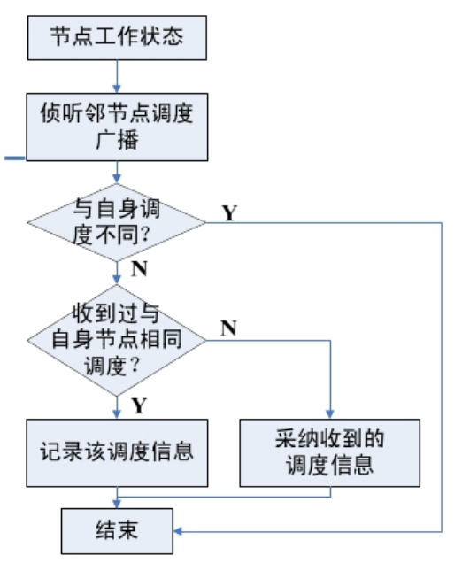

# MAC协议
## WSN主要关注点
 - 节约能量
 可能造成网络能量浪费的主要原因:
 	- 冲突 Collisions
 	- 串音 Overhearing
 	- 空闲监听 Idle listening
 	- 控制消息开销 Protocol overhead

## WSN信道共享
### 传统网络信道共享方式
 - 点对点(两节点)
 - 点对多点(基站)
 - 多点共享(对讲机)
###WSN信道共享方式
#### 多跳共享
 - 覆盖范围内的节点(称为邻居)才能够接收到
 - 覆盖范围以外的节点感知不到任何通信的存在
#### 优势
 - 发送节点覆盖范围以外的节点不受发送节点的影响,大大提高频率的空间复用度

#### 影响
 - 报文冲突与节点所处的地理位置相关
 - 局部事件VS全局事件
 - **隐藏终端、暴露终端**
 解决方法 RTS/CTS 握手

## MAC协议分类
 - 分配信道的方式
 	- 竞争型 Contention-based MAC protocol
 	- 分配型 Schedule-based MAC protocol
 	- 混合型
- 使用的信道数目
 	- 单信道
 	- 双信道
 	- 多信道
- 控制类型
 	- 集中式
 	- 分布式
 	
# 竞争型MAC协议
 - 按需使用信道
 - 当节点需要发送数据时,通过竞争方式使用无线信道
 - 如果发送的数据产生了冲突,就按照某种策略重发数据,直到数据发送成功或者放弃发送
 - e.g. CSMA/CA、S-MAC 、T-MAC

## 两种访问控制方式 
 - **分布式协调(Distributed coordination function, DCF)**
	 - 基本访问控制方式
	 - CSMA/CA
	 - 随机避退
	 - 主动确认
 - 点协调(Point coordination function, PCF)
### CDMA/CA (WLAN)
 -  送出数据前,监听媒体状态,若无人使用媒体,维持一段时间后,再等待一段随机的时间后依然没有人使用,立即送出数据。由於每个设备采用的随机时间不同,所以可以减少冲突的机会。
 - 送出数据前,先送一段小小的请求传送报文(RTS) 给目标端,等待目标端回应 CTS报文后,才开始传送。 利用RTS-CTS握手(handshake)程序,确保接下来传送资料时,不会发生碰撞。

### DCF


### 三种基本帧间间隔(IFS)
 > 在媒体上传送的帧与帧之间的空闲时间

 - SIFS(Short IFS):短帧隙
 	- ACK帧、CTS帧、控制帧	
 
 - DIFS(DCF IFS):分布式协调功能帧隙
 	- 数据帧、管理帧
 
 - PIFS(PCF IFS):点协调功能帧隙
 	- 用于获得在无竞争访问周期启动时的信道访问优先权

 > DIFS>PIFS>SIFS
 
### 退避时间(Backoff interval)
 > `退避时间=Random()* aslottime`


# S-MAC 协议
## 主要思想
1. 采用**周期性的休眠/侦听**方法减少空闲侦听带来的能量损耗;
2. 当有节点收发数据时,与此无关的邻居节点进入休眠**减少冲突与串音**带来的能量损耗;
3. 采用**消息传递机制**,减少控制消息带来的能量损耗;
4. 采用**自适应的侦听**机制,减少消息传输延迟

## 1-周期性睡眠和侦听
 - for each node: 
 	- Wakeup Period
 	- Active Period
 	- Sleep Period

 
 - 占空比: `Duty Cycle = Ta/Tw`
 - **降低idle时间**
### 节点启动时的处理流程


### 节点工作中的处理流程


 - 相邻的节点同步形成虚拟的簇 clusters
 - 也称“**时间表同步的岛屿**”
 - 边界节点记录两个或者多个调度
 - 边界节点睡眠时间短

## 2-串音避免
 - 串音:节点会听到其他节点的数据传输,与自己无关。
### 解决办法
 - 信道忙时进入睡眠
### 睡眠节点选择
- 发送节点和接收节点的所有**直接邻居**
- 用**NAV**决定休眠时间

## 3-流量自适应侦听
 - 周期性睡眠导致了通信延迟的累加
 
 
> B 知道C下一次醒来的时间,但是却不想等到那时,而希望立刻把消息传给C。

### 解决办法
 - 通信节点的邻居节点在此次通信结束（从NAV得知）后唤醒,并且保持侦听一段时间。
 - 如果邻居节点在这段时间收到RTS帧,则可以立刻接收数据,而不需要等到下一个侦听周期。

## 4-消息传递机制
 - 将长的信息包分成若干个短的信息段DATA;
 - 使用一个RTS/CTS控制分组占用信道;
 - 每个DATA都有ACK保障传输成功;
 - 任一DATA未收到应答,则立刻重传

## SMAC 缺点
 - 调度周期是固定的,不适应网络流量变化
 - 如果网络中消息传递的速率很低的话,仍然有大量的能量浪费在idle-listening
 
# T-MAC
 - 动态调整调度周期中的活跃时间长度
 - 在TA时间内没有发生激活事件则进入睡眠
## T-MAC 工作过程
 - 节点处于侦听状态,直到TA时间没有激活事件发生
 	- 周期时间定时器溢出
	- 从无线信道上收到数据
 	- 通过接受信号强度指示RSSI感知到了存在无线通信
 	- 通过侦听RTS-CTS帧,确认邻居的数据交换已经结束
## TA选择
 - TA 决定了每个周期的最短空闲侦听时间。
 - TA的取值约束:
```
TA > C+R+T
C – 竞争信道的时间;
R – 发送RTS包所需的时间;
T – 从RTS发送结束到开始发送CTS的时间;
```
```
TA = 1.5 * (C+R+T);
```
## 早睡问题
### 现象
 - 在下沉通信模式中(A给B发，B给C发，C给D发)：
 
 - 如果节点C由于来自节点B的RTS分组而失去竞争，则它将回复一个CTS分组，这也可以被节点D听到。在这种情况下，当C和B之间的通信结束时，节点D将被唤醒。
 - 但是，如果节点C因为串音——听到从B到A的CTS数据包——而失去竞争，则C必须保持沉默。
 - 由于D不知道A与B之间的通信，其侦听时间将结束，节点D将进入睡眠。只有在下一帧开始时，节点C才有新的机会发送给节点D。
- 因此，节点C向节点D成功发一个包的概率为50％，成功发两个包的概率为25%...
### 结果
 - 早睡问题使T-MAC的总吞吐量降低到传统协议或S-MAC的最大吞吐量的一半以下

### 解决方法
####  未来请求发送Future RTS (FRTS)


 - 节点C侦听到发给其他节点的CTS包(发生串音)时，立即发送 未来请求发送(FRTS)包，FRTS包中包含阻塞的数据通信长度(由CTS可知)
 - 节点D接收到FRTS数据包后，在特定时刻变为侦听状态。
 - 为了防止任何其他节点占用信道，节点A发送一个小的DS包。
 - DS包和FRTS包可能会冲突，导致DS包丢失，这是可以接受的，因为DS包中没有任何有用的信息。
 
 - 优点
	 - 提高了吞吐率、减少延时
 - 缺点
	 - 额外的通信开销
	 - 降低能量效率

#### 满缓冲区优先 Full-Buffer Priority


 - 当一个节点的传输/路由缓冲区几乎满时，它可能更愿意发送而不是接收。
 
 - 当一个节点收到一个RTS包时，它要立即发送自己的RTS包到另一个节点，而不是像通常情况一样，回应CTS包
 - 类似于流量控制模型

 - 优点
	 - 一定程度上控制了网络的流量
	 
 - 缺点
  	- 数据量较大时,增加了冲突的可能


